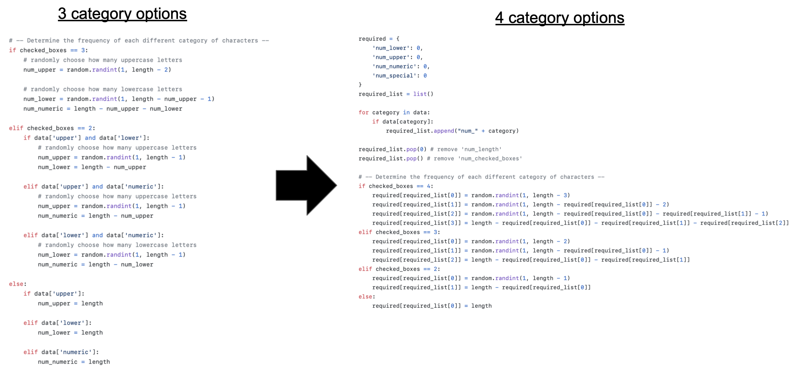

# Password Generator
I started this personal project to increase my understanding of web development using Python, Flask, HTML, CSS, and Bootstrap. 

## Website: https://jbian92-password-generator.herokuapp.com/ 

## Features
- Randomly generates a password based on the user's password requirements (e.g. length, upper/lower case letters, numbers, special characters)
- Text animation from Welcome screen to User Input screen 
- Copy to Clipboard button to copy the generated password to the user's clipboard

## Currently Working On...
- Creating an option to create an account and save generated passwords using MongoDB
- Adding a favicon/tab icon
- Adding a navbar
- Adding a footer

## Challenges Faced
### 1. Reducing the amount of if-elif-else statements when determining the frequency of each different category of characters.
- **Problem**: Looking at all the if-elif-else statements in my code, I thought that there must be a simpler way to complete the same task. 
- **Solution**: After some thinking, googling, and trying out different ideas, I was able to successfully make my code more efficient and readable by implementing a list with the required categories checked off by the user and using a dictionary to store the required categories and their corresponding frequency. This also makes adding more category options easier in the future. 



### 2. Adding Text Animations.
- **Problem**: I wanted the "welcome" text to fade in and then fade out, allowing the user input prompt to then fade in and stay on the page. However, I didn't know how to animate text. 
- **Solution**: After googling "css text animations" and testing different pieces of code, I came across the **@keyframes** rule, which allows an animation to gradually change from the current style to the new style. 
  ```
  @keyframes fadeInOut {
    0%   {opacity: 0;}
    10%  {opacity: 0.5;}
    35%  {opacity: 1;}
    75%  {opacity: 1;}
    100% {opacity: 0;}
  }

  @keyframes fadeIn {
    0%   {opacity: 0;}
    10%  {opacity: 0.5;}
    35%  {opacity: 1;}
    75%  {opacity: 1;}
    100% {opacity: 1;}
  }
  ```
  Using these keyframes allowed me to bind these animations to different elements in my code, such as my "welcome" text. However, I still struggled to keep the user input prompt on the page after fading in, which I later realized required the **animation-fill-mode** property in order to retain the style values from the last keyframe when the animation ends.
  ```
  .fade-in-text {
    opacity: 0;
    animation-name: fadeIn;
    animation-duration: 2s;
    animation-fill-mode: forwards;
  }
  ```
  I'm very proud at how the animation turned out: 
  
